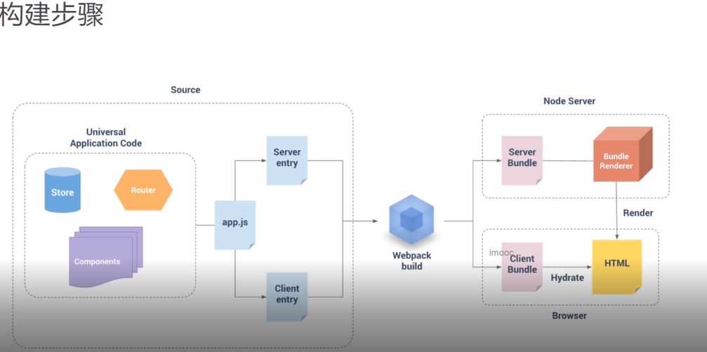

## Vite+Vue3+TS+SSR的基本原理、构件步骤、目录结构

### 基本原理
- 通过Vue的server-renderer模块将Vue应用实例转换成一段纯文本的HTML字符串
- 通过Nodejs创建一个静态Web服务器
- 通过Nodejs将服务端所转换好的HTML结构发送到浏览器端进行展示


### 构件步骤
- vue2 版本的 也适合该版本


### 目录结构
```
- index.html
- src
 - main.ts          // 通用的应用代码
 - entry-client.ts  // 客户端入口、只在浏览器中运行
 - entry-server.ts  // 服务端入口、只在服务端运行
- server.js         // Nodejs服务
```


